# 🔐 Secret Chat

**Secret Chat** is a full-featured Android messaging application built with **Kotlin**. It is a WhatsApp-style chat platform supporting both **1-on-1 private chats** and **group conversations**, with real-time messaging powered by a **Phoenix (Elixir) WebSocket backend**.

---

## 📸 Screenshots & Features

### Authentication
Users can register and log in securely. The registration process includes generating a public key for future End-to-End Encryption support.

| Login | Register |
|:---:|:---:|
| 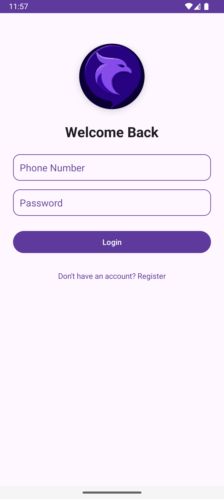 | 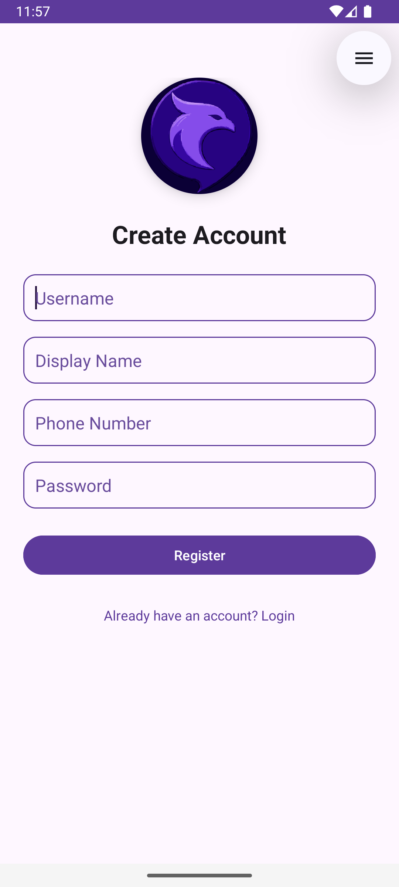 |

### Home & Navigation
The Home screen displays all your active conversations sorted by the last message time, along with unread indicators. A sidebar provides quick access to your profile.

| Home Screen | Navigation Drawer |
|:---:|:---:|
| 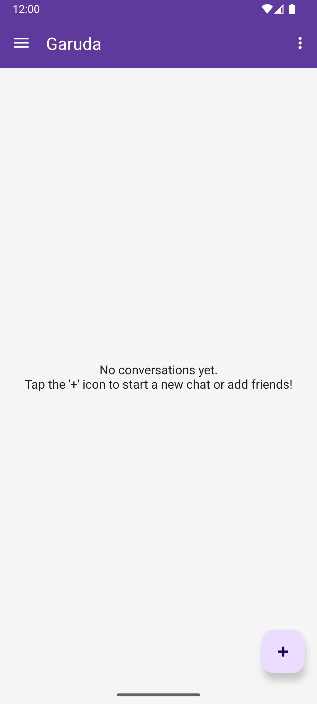 | 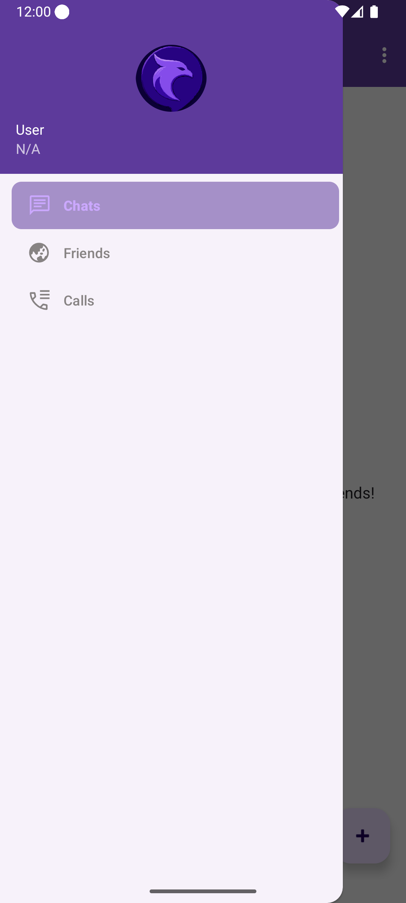 |

### Messaging & Groups
Real-time chat with support for text, images, videos, audio, and voice recordings. Group chats include a detailed info sheet to manage members and admins.

| Chat Room | Group Details |
|:---:|:---:|
| 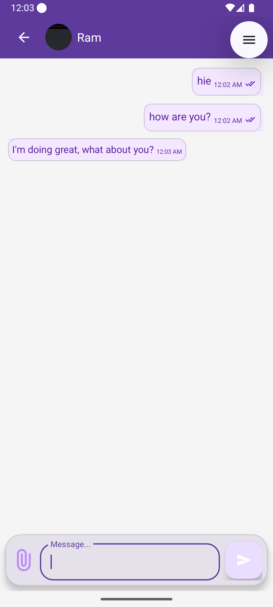 | 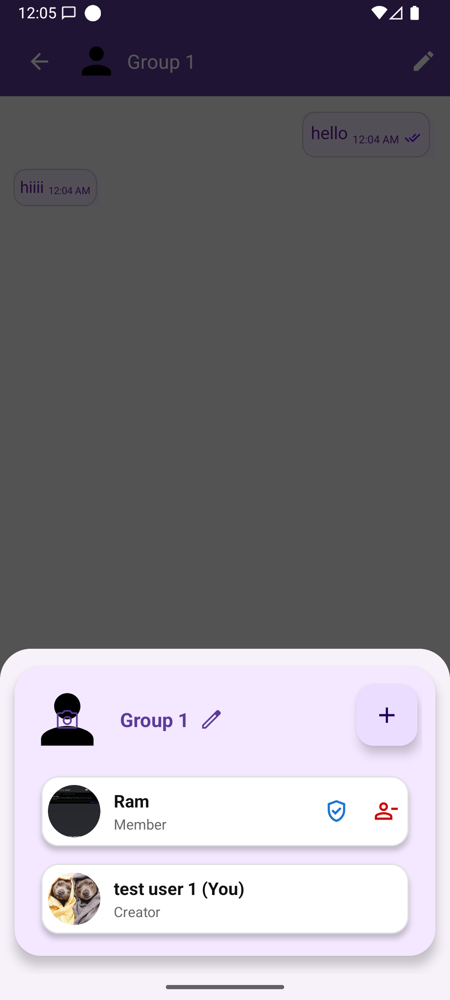 |

### Social Graph
Manage your network through the Friends tab: view friends, discover users, accept/decline pending requests, and create new conversations seamlessly.

| Friends List | New Conversation |
|:---:|:---:|
| 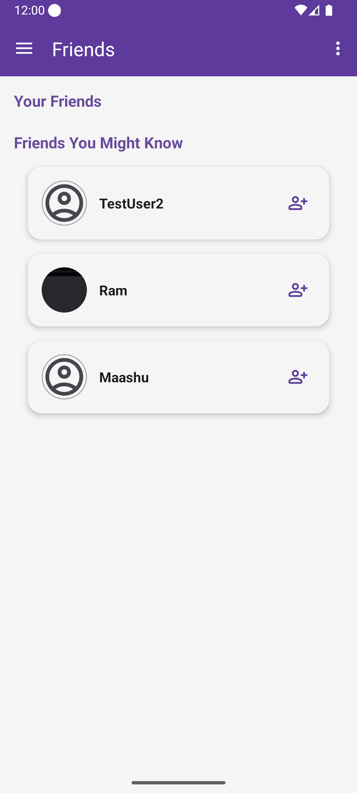 | 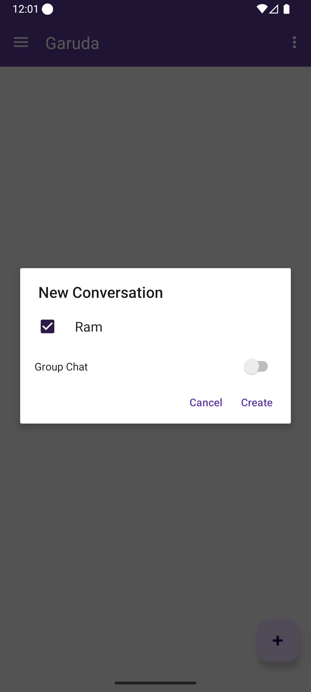 |

### Rich Notifications & Status Tracking
Receive push notifications even when the app is killed. You can reply directly from the notification shade or mark messages as read. The app tracks detailed message delivery statuses (`SENT`, `DELIVERED`, `READ`).

| Quick Reply | Delivery Status |
|:---:|:---:|
| 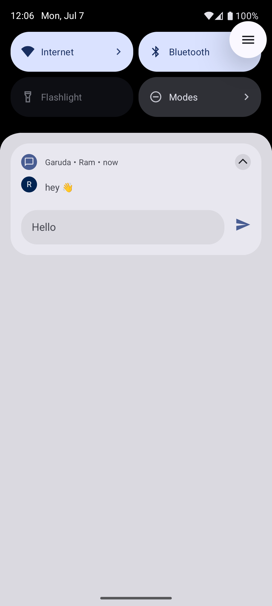 | 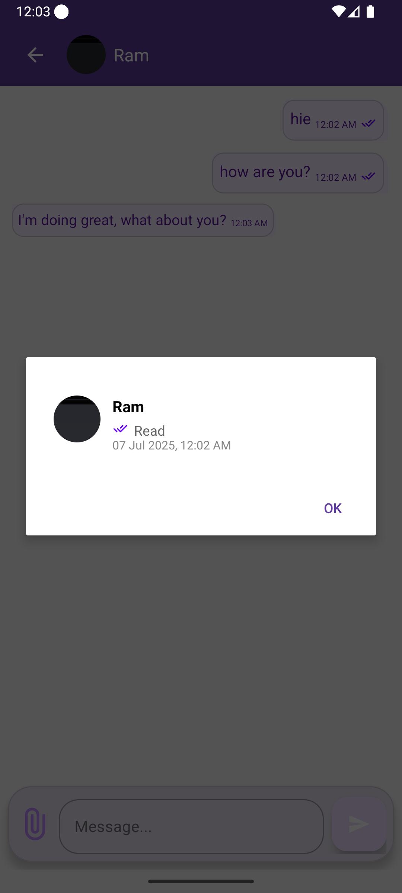 |

---

## 🛠️ Tech Stack

| Layer | Technology |
|---|---|
| **Language** | Kotlin |
| **UI Framework** | Android Views (XML) + Jetpack Compose (partial) |
| **Navigation** | Jetpack Navigation Component (Safe Args) |
| **Architecture** | MVVM (ViewModel + LiveData + Repository pattern) |
| **Networking (REST)** | Retrofit 2 + OkHttp + Gson |
| **Real-time** | Phoenix Channels over WebSocket (custom `PhoenixChannel` client) |
| **Push Notifications** | Firebase Cloud Messaging (FCM) |
| **Image Loading** | Glide (with Base64 custom `ModelLoader`) |
| **Animations** | Lottie |

---

## 🏗️ System Architecture

### 1. Dual-Channel WebSocket Strategy
The app uses a robust dual connection strategy to handle real-time events without dropping messages:

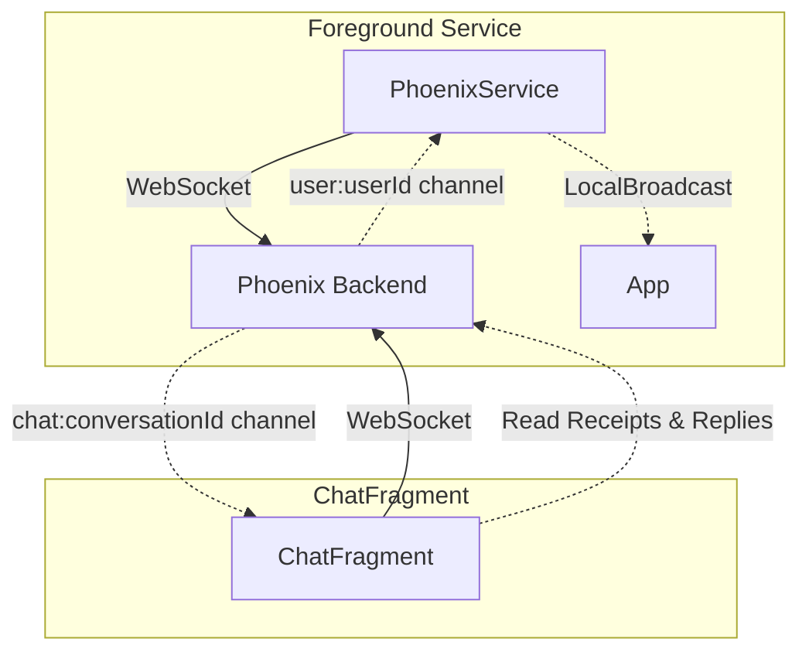

- **`PhoenixService`**: A Foreground Service that connects to a generic user channel (`user:{userId}`). It listens globally for new messages, friend requests, and status updates, broadcasting them to any active fragments.
- **`ChatFragment`**: When a specific chat is open, a secondary WebSocket connection is established exclusively for that conversation (`chat:{conversationId}`). This optimizes local rendering, typing indicators, and immediate read receipts.

### 2. Push Notifications (Offline Flow)
When the WebSocket connection drops (app killed or running in background), Firebase Cloud Messaging (FCM) takes over:

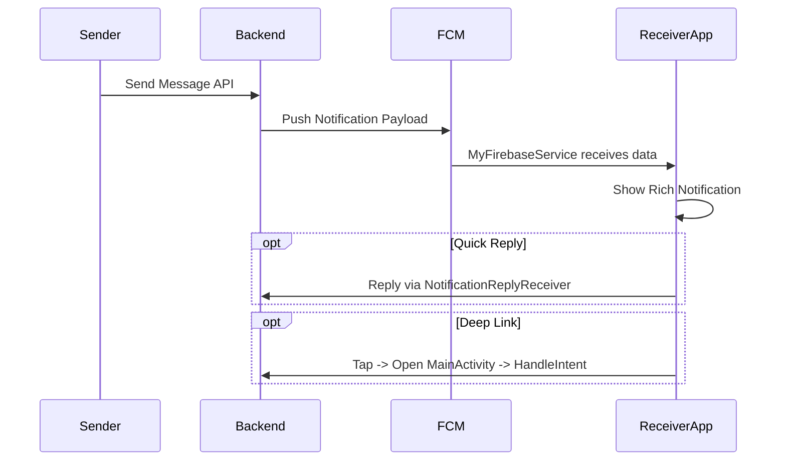

### 3. Base64 Media Handling
The app eschews traditional CDN uploads in favor of direct Base64 encoding. Avatars, group icons, and image attachments are resized on the client side, compressed, converted to Base64 strings, and transmitted over JSON. A custom Glide `ModelLoader` decodes these strings instantly for UI rendering.

---

## 📂 Project Structure

```text
app/src/main/java/com/codewithram/secretchat/
├── MainActivity.kt               ← Single-activity host
├── data/
│   ├── Repository.kt             ← Data abstraction layer
│   ├── model/                    ← Request/Response structures
│   └── remote/
│       ├── ApiClient.kt          ← Retrofit singleton
│       └── TokenAuthenticator.kt ← JWT auto-refresh interceptor
├── service/
│   ├── FirebaseMessagingService.kt  
│   ├── PhoenixService.kt            
│   └── NotificationReplyReceiver.kt 
└── ui/
    ├── home/
    │   ├── ChatFragment.kt       ← Core messaging interface (~1400 lines)
    │   ├── HomeFragment.kt       ← Active conversations list
    │   ├── PhoenixChannel.kt     ← Custom Phoenix WebSocket implementation
    │   └── readStatusManager.kt  ← Local read-state tracker
    ├── gallery/                  ← Friend discovery and management
    ├── login/                    ← Auth flow
    └── splash/                   ← Session validation
```
